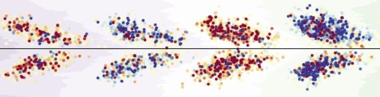
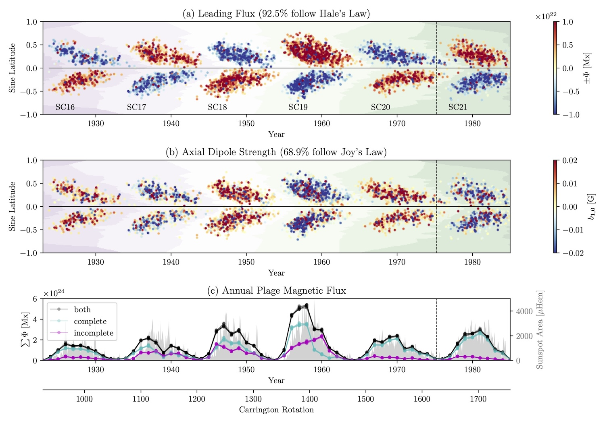
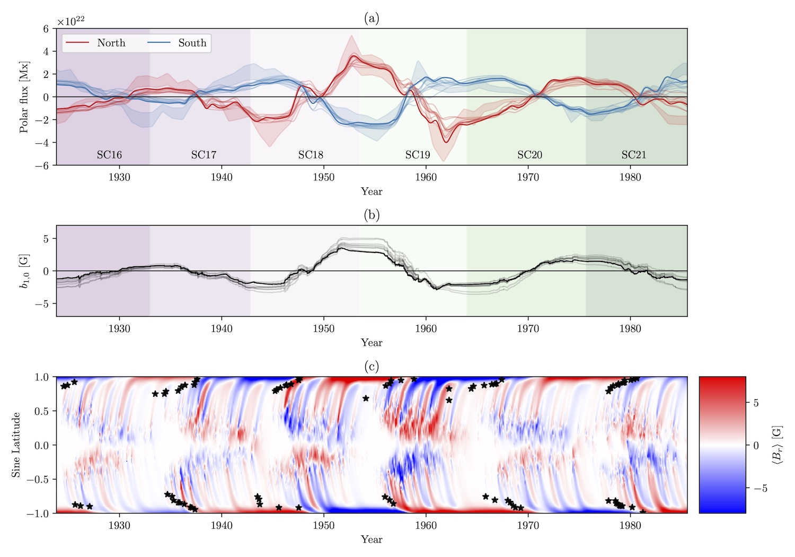

# sft-historical

A.R. Yeates, Durham University, 2024-Nov

===================================================

Python code (3.x) and Fortran code for **SFT modelling** driven by magnetic regions from **historical data**.

This code accompanies a paper: [Yeates, Bertello, Pevtsov and Pevtsov, Latitude Quenching Nonlinearity in the Solar Dynamo, *ApJ* **978**, 147, 2025](http://doi.org/10.3847/1538-4357/ad99d0) Development was supported by an STFC grant (https://gtr.ukri.org/projects?ref=ST%2FW00108X%2F1).

Functionality includes:

1. Generation of a dataset of **magnetic regions** based on Ca K synoptic maps, with [or without] polarities informed by sunspot measurements. Currently data from [Mount Wilson Observatory](https://en.wikipedia.org/wiki/Mount_Wilson_Observatory) are used.
2. Optimising parameters of a classical **surface flux transport** (SFT) model, using the historical regions for the source term, and polar faculae observations as ground truth to constrain the model.

## Software requirements

The main non-standard Python packages used are `astropy` and `sunpy`, as well as `multiprocessing`. These can all be installed via `pip`.

For speed, SFT model runs call Fortran90. Transfer of the data requires use of the [netcdf-fortran](https://docs.unidata.ucar.edu/netcdf-fortran/current/) library, and you need to provide the correct path to it in `sft/fortran/Makefile`.

## Input data requirements

To run the code you will also need to download observational input data from several sources:
1. Digitized MWO Ca II K synoptic maps, from [Bertello+2020](https://dataverse.harvard.edu/dataset.xhtml?persistentId=doi:10.7910/DVN/RQSEJ8).
2. Digitized MWO sunspot data from [Pevtsov+2019](https://www.issibern.ch/teams/solheliomagnet/index.php/datasets-relevant-to-the-project/dataset-of-sunspot).
3. Sunspot data from [Leussu+2021](https://cdsarc.cds.unistra.fr/viz-bin/cat/J/A+A/599/A131#/browse).
4. Polar flux estimated from faculae, from [Munoz-Jaramillo+2016](https://dataverse.harvard.edu/dataset.xhtml?persistentId=doi:10.7910/DVN/KF96B2).

Optionally for comparison plots, the code also uses:
1. Sunspot area data from [Mandal+2020](https://cdsarc.cds.unistra.fr/viz-bin/cat/J/A+A/640/A78).
2. Polar crown filament data from [Xu+2021](https://ui.adsabs.harvard.edu/abs/2021ApJ...909...86X/abstract). [Not freely available and would require request to the authors.]

The paths to the relevant input data files need to be updated in `./_data_/paths.py`

## Quick-start guide

There are two separate stages:

1. Generating a database of magnetic regions. `./regions/`
2. Fitting an SFT model to this database. `./sft/`

Full details of the methodology underlying the code are given in the paper.

### 1. Generating a database of magnetic regions

First set the parameters in `params.py` (or leave the defaults), then run `./regions/full-generate-ensemble.py` to build an ensemble of multiple realizations. Parameters are selected at the top of the file. Note that this can take quite a long time to run.

*Note: individual "bad" regions (typically those corrupted by data gaps) are removed after generating the database. For the default parameters, I include a list of these in the file `./regions/full-bad-regions.txt`. These are moved into a different directory at the end of the `./regions/full-generate-ensemble.py` script, so as to exclude them from subsequent analysis. If you change any of the parameters or input data, you would need to comment out this section of code before running the script, then manually inspect the images of the regions and remove those deemed unacceptable.*

To visualize the extracted regions, run `./regions/full-plot-realization.py`. This will plot the regions for a single realization, along with the annual fluxes from the regions for all of the realizations:

### 2. Fitting an SFT model

Once you have an ensemble of different realizations of magnetic regions (which could have just one member), you can optimize the SFT model against each member of this ensemble by running `./sft/run_optim_sft.py`. Again, parameters are set at the top of the file. For a large ensemble this could take some time to run.

To visualize the results, run `./sft/plot-optim.py`. This will show how the polar field of the optimum runs compares with observations, as well as showing the magnetic butterfly diagram for the overall best run. It will also show plots of the objective/cost function against the parameters, for all SFT runs in a single realization of the magnetic regions: 

### 3. [optional] Calibrating and comparing to NSO magnetograms

If you want to see how the regions are extracted (particularly if you change the parameters or the input), you can use the script `./regions/nso-calibrate.py` to compare the extracted regions with NSO magnetograms, for a specified period where these are available. There are also some plots to illustrate the variation within the ensemble – you first generate such an ensemble with `./regions/nso-generate-ensemble.py` and then plot them with `./regions/nso-plot-ensembles.py`.